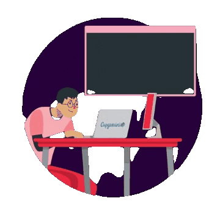

 Hello, I'm Samuel Acosta
===============================================================================================================================

  

## 👨‍💻 About Me
I'm a software engineering student at UNEG.

* 🌍  I'm based in Venezuela
* ✉️  You can contact me at [sonosamuelacosta@gmail.com](mailto:sonosamuelacosta@gmail.com)
* 🧠  I'm currently learning PHP, relational databases, and web design

## 🛠️ My Stack

  

## 💻 Socials

## 📊 Badges

<b>My GitHub Stats</b>

